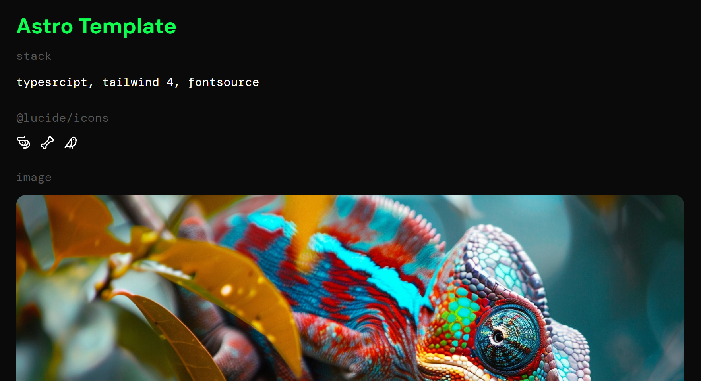

# ☄️ Astro Template

Basic boilerplate project for an [Astro](https://astro.build/) website. This template is ideal as a starter for a static
website to be optimized and deployed. The project includes the following technologies:

- [TypeScript](https://www.typescriptlang.org/)
- [Tailwind V4](https://tailwindcss.com/blog/tailwindcss-v4)
- [Fontsource](https://fontsource.org/)

Additional development tools:

- [Prettier](https://prettier.io/)
